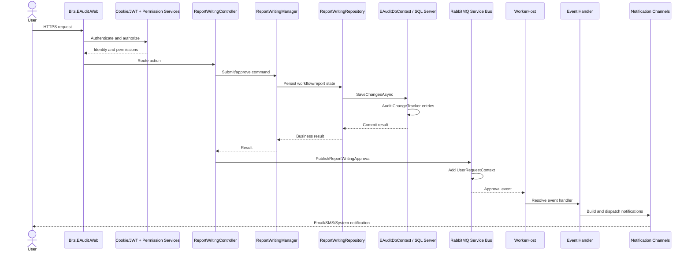

# E-Audit Low-Level Design

## 1. Purpose and Scope

This document describes the implemented low-level design of the E-Audit solution. It is based on the current source code, project files, startup configuration, dependency registration, event contracts, background jobs, and database access code.

This is an implementation-as-built document. It does not assume a pure Clean Architecture, CQRS, microservice, or repository-per-aggregate design where the code does not currently implement one.

## 2. Solution Composition

The solution is a layered monolithic platform with multiple executable hosts and shared business assemblies.

| Area | Project | Responsibility |
|---|---|---|
| Web UI | `Presentation/Bits.EAudit.Web` | ASP.NET Core MVC/Razor application, Areas, authentication, session, views, DMS BFF endpoints |
| API | `Presentation/Bits.EAudit.WebApi` | ASP.NET Core Web API host using the shared Manager/Repository stack and JWT configuration |
| Worker | `Presentation/Bits.EAudit.WorkerHost` | Windows Service host for RabbitMQ consumers, Hangfire server, notification processing and scheduled jobs |
| Contracts | `EventHandlers/Bits.EAudit.Events` | Event DTOs, `IBusMessagePublisher`, user request context |
| Event handlers | `EventHandlers/Bits.EAudit.EventHandlers` | Message handlers for workflow, reporting, notification and integration events |
| Business contracts | `Business/Bits.EAudit.IManager` | Manager interfaces |
| Business implementation | `Business/Bits.EAudit.Manager` | Application/business orchestration and notification publishers |
| Data contracts | `Business/Bits.EAudit.IRepository` | Repository interfaces |
| Data implementation | `Business/Bits.EAudit.Repository` | EF Core/Dapper repositories and stored-procedure access |
| Persistence model | `Shared/Bits.EAudit.EntityModel` | Database-first EF Core entities and `EAuditDbContext` |
| View contracts | `Shared/Bits.EAudit.ViewModel`, `Shared/Bits.EAudit.PageViewModel` | MVC/API request and response models |
| Core composition | `Core/Bits.EAudit.Core.Dependency` | Database, AutoMapper, security and assembly-wide DI registration |
| Notifications | `Notifications/Bits.EAudit.Notifications` | Email, SMS and system notification channels and data loaders |
| Framework | `Framework/*` | Caching, PDF, grid, flash message, security and MVC infrastructure |
| Database scripts | `Database/Bits.EAudit.DatabaseScripts` | Environment-specific SQL release scripts and application document assets |

## 3. Runtime Hosts

### 3.1 Web host

The Web host is an ASP.NET Core `net8.0` in-process IIS application. Its composition root is `Presentation/Bits.EAudit.Web/Startup.cs`.

Configured services include MVC/Razor, Razor runtime compilation, session, antiforgery, cookie authentication configuration, CORS, response compression, memory/distributed memory cache, EF Core, Hangfire storage, RabbitMQ service bus, notification publishers, secured-link filtering, user context, and the DMS HTTP client.

Pipeline order implemented in `Startup.Configure`:

1. Developer exception page or exception handler.
2. HSTS and HTTPS redirection.
3. Static files.
4. Routing.
5. Authentication.
6. Authorization.
7. Session.
8. Development-only Hangfire dashboard.
9. `VisitLoggingMiddleware`.
10. Area, default MVC and Razor Page endpoints.

### 3.2 API host

The API host is a separate ASP.NET Core executable. It calls `RegisterDbAndMapperAPI`, configures JWT bearer authentication from the `Token` configuration section, enables controllers, session, response caching configuration, authentication and authorization, then maps controllers and conventional routes.

The API host shares the same EntityModel, Manager and Repository assemblies. Therefore, it is not an independent domain service; it is another presentation host over the same business/data implementation.

### 3.3 Worker host

The Worker host is configured with `UseWindowsService()` and runs as a long-running process. It registers the same EF Core, Manager, Repository, AutoMapper and infrastructure stack as the Web host, plus:

- `IEAuditUserContextProvider` implemented by the host context provider.
- Notification channels and notification data loaders.
- RabbitMQ consumers for the declared event types.
- Hangfire SQL Server storage and `AddHangfireServer()`.
- `WorkerService` as a hosted service.
- Scheduled and overdue notification job implementations.

## 4. Request Processing Design

### 4.1 MVC request path

```text
Browser
  -> HTTPS
  -> ASP.NET Core routing
  -> Authentication / Authorization
  -> Area Controller
  -> ViewModel binding and validation
  -> Manager interface
  -> Repository interface
  -> EAuditDbContext / Dapper / stored procedure
  -> SQL Server
  -> AutoMapper
  -> ViewModel / View / JSON response
```

Most feature controllers are organized under MVC Areas, for example `AuditManagement`, `AuditPlan`, `AuditSchedule`, `Workflow`, `Administration`, `Report`, `APFManagement`, and `Dms`.

The route conventions are registered in `Presentation/Bits.EAudit.Web/Startup.cs`:

- `Identity/{controller=Account}/{action=Login}/{id?}`
- `{area:exists}/{controller=Home}/{action=Index}/{id?}`
- `{controller=Home}/{action=Index}/{id?}`

### 4.2 API request path

```text
API client
  -> HTTPS / JSON
  -> JWT bearer authentication
  -> Controller
  -> Shared Manager
  -> Shared Repository
  -> EAuditDbContext / SQL Server
  -> JSON response
```

### 4.3 Report Writing approval path

The implemented representative flow is:

```text
ReportWritingController.SendForApproval
  -> deserialize posted JSON model
  -> local submit/approval operation
  -> ReportWritingManager
  -> ReportWritingRepository / workflow repositories
  -> EAuditDbContext.SaveChangesAsync
  -> SecuredLinkManager disables one-time link
  -> BusMessagePublisher.PublishReportWritingApproval
  -> BusMessagePublisher adds UserRequestContext
  -> IBusMessageDispatcher.PublishAsync
  -> RabbitMQ infrastructure
  -> Worker consumer
  -> ReportWritingApprovalEventHandler
  -> notification/MIS/reporting side effects
```

`SendForApproval` uses `[AllowAnonymous]` together with `SecuredLinkActionFilter`, so the public-link workflow is intentionally secured by the filter rather than by the normal controller authorization requirement.

## 5. Presentation Layer Design

### 5.1 Controller responsibilities

Controllers in the Web project are thin-to-medium orchestration classes. They commonly:

- Receive MVC form, query, route or JSON input.
- Resolve a Manager interface through constructor injection.
- Call Manager methods.
- Set flash messages or return partial/views/JSON.
- Publish workflow or notification events after business operations.
- Apply `[Authorize]`, response-cache attributes and secured-link filters.

`EAuditControllerBase` provides shared functionality such as user identity extraction, view rendering, report path handling, AJAX validation, JSON settings, component data helpers and report/PDF support.

### 5.2 ViewModel boundary

The shared ViewModel projects contain input models, edit models, page models, search models and response models. AutoMapper profiles in `Core/Bits.EAudit.Core.Mapping` map between ViewModels and database entities.

Observed profiles include:

- `SetupMapperProfile`
- `AuditPlanMapperProfile`
- `SecurityMapperProfile`
- `AdminMapperProfile`
- `ReportWritingMapperProfile`
- `APFMapperProfile`
- API-specific `SettingsMapperProfile`

### 5.3 DMS frontend and BFF service

The DMS Angular application is located under `Presentation/Bits.EAudit.Web/Areas/Dms/ClientApp`. The project uses Angular 20.1.x, Angular Material, Transloco, Quill, jsPDF and related frontend packages.

The Web project builds the Angular application through the `BuildDmsAngularApp` MSBuild target and places the result under `wwwroot/dms` during the applicable build/publish path.

The MVC DMS service `DmsService` is a typed HTTP client implementing `IDmsService`. It:

- Reads `DmsServiceOptions`.
- Sets `HttpClient.BaseAddress` from `BaseUrl`.
- Applies the configured timeout.
- Delegates item, search, share, activation, restore, delete and related commands to the downstream DMS API.
- Uses the current `IEAuditUserContextProvider` to add request user context and tenant/vertical headers in its internal request methods.

## 6. Business Layer Design

### 6.1 Manager pattern

The code uses Manager interfaces and concrete Manager classes as application/business services. Managers coordinate repositories and other managers, apply workflow rules, map entities, and publish events.

Examples include:

- Audit plan and schedule managers.
- Audit conduction managers.
- Report writing, report, observation and action-plan managers.
- Workflow managers.
- Security, role, user and permission managers.
- Notification and email/SMS managers.

The Manager layer is not a strict isolated domain layer. Managers may directly depend on multiple repositories, `EAuditDbContext`, `IHttpContextAccessor`, options, notification publishers and event publishers. This is an important implementation constraint for new features and refactoring.

### 6.2 Report Writing aggregate-like flow

The Report Writing feature is distributed across:

- `Presentation/Bits.EAudit.Web/Areas/AuditManagement/Controllers/ReportWritingController.cs`
- `Business/Bits.EAudit.Manager/ReportWriting/ReportWritingManager.cs`
- `Business/Bits.EAudit.Manager/ReportWriting/ReportWritingReportManager.cs`
- `Business/Bits.EAudit.Manager/ReportWriting/ReportWritingActionPlanManager.cs`
- `Business/Bits.EAudit.Repository/ReportWriting/ReportWritingRepository.cs`
- Report Writing interfaces in `Business/Bits.EAudit.IManager/ReportWriting` and `Business/Bits.EAudit.IRepository/ReportWriting`.

The Manager coordinates report writing, conduction, workflow, dispatch, signatory, document and notification collaborators. The Repository changes report-writing entities, workflow history and related records, then uses the shared DbContext transaction boundary.

## 7. Repository and Persistence Design

### 7.1 Generic repository base

`Business/Bits.EAudit.Repository/RepositoryBase.cs` is the common base for repositories. It provides shared delete/verification behavior, audit metadata handling and database access helpers. It also contains examples of cache usage and stored-procedure calls.

Repositories conventionally:

- Receive `EAuditDbContext` through DI.
- Query generated DbSet properties and views.
- Use `AsNoTracking` selectively where implemented.
- Use LINQ for many reads and writes.
- Use Dapper/stored procedures for selected operations.
- Set `CreatedBy`, `UpdatedBy` or operation-user parameters from `_context.UserID`.
- Call `_context.SaveChangesAsync(cancellationToken)` for writes.

### 7.2 EF Core database-first model

`Shared/Bits.EAudit.EntityModel/EAuditDbContext.cs` is a generated/database-first EF Core model. Entity classes are grouped by database schema under `Models`.

The model is therefore schema-first rather than migration-first. Database changes should be introduced through the established SQL release-script process in `Database/Bits.EAudit.DatabaseScripts`, followed by model regeneration or compatible partial-model updates.

### 7.3 DbContext scope and user context

`EAuditDbContext` receives `IHttpContextAccessor` and captures the current identity when constructed:

- `UserID`
- `LoginID`
- `UserPin`
- `UserName`
- `UserEmail`
- `LoginName`
- Controller and action names

Web requests populate these values from claims. The Worker host uses its own `EAuditHostUserContextProvider` because there is no HTTP request.

### 7.4 SaveChanges transaction and audit trail

The partial DbContext extension overrides `SaveChangesAsync` and performs the following sequence:

1. Begins a database transaction.
2. Collects detailed entity audit information from the ChangeTracker.
3. Updates auditable entity fields using the current `UserID`.
4. Adds `AppDataEntityAuditLog` rows for changed entities.
5. Calls the base EF Core save operation.
6. Commits the transaction.
7. Rolls back and rethrows on failure.

This means database writes and their entity audit records are intended to commit atomically inside the same DbContext transaction.

## 8. Event and Messaging Design

### 8.1 Publisher abstraction

`IBusMessagePublisher` defines explicit methods for each current event contract, including:

- `ReportWritingApprovalEvent`
- `DynamicMISReportDataChangedEvent`
- `SendNotificationEvent`
- `AuditScheduleAuditorsAddedEvent`
- `NotificationCreatedEvent`
- `ZoneManagerChangedEvent`
- `AuditScheduleApprovalEvent`
- `AuditChangeRequestEvent`
- `ForwardingLetterApprovalEvent`
- `NotifyActionOwnersEvent`
- `ActionPlanCreateEmailRequestedEvent`

`BusMessagePublisher` obtains `IBusMessageDispatcher` from the platform infrastructure. For most events it copies the current `UserRequestContext` onto the event before calling `PublishAsync`.

`NotificationCreatedEvent` is the observed exception: the publisher sends it without adding the current user context.

### 8.2 Web host consumers

The Web host registers a service bus provider with a consumer for `NotificationCreatedEvent`. This allows notification-created messages to be consumed by the Web process as configured.

### 8.3 Worker host consumers

The Worker host registers consumers for:

- `ReportWritingApprovalEvent`
- `DynamicMISReportDataChangedEvent`
- `SendNotificationEvent`
- `AuditScheduleAuditorsAddedEvent`
- `AuditScheduleApprovalEvent`
- `ZoneManagerChangedEvent`
- `AuditChangeRequestEvent`
- `ForwardingLetterApprovalEvent`
- `NotifyActionOwnersEvent`
- `ActionPlanCreateEmailRequestedEvent`

Each event has a corresponding handler registration and a MassTransit/platform adapter consumer.

### 8.4 Consistency model

The code publishes events after business operations, but the repository transaction and broker publication are not implemented as a visible transactional outbox in the inspected code. Therefore, an event may be published after a successful save or may be lost if the process fails between database commit and publication. New critical workflows should document and test this existing consistency boundary.

## 9. Background Processing

The Worker host runs Hangfire with SQL Server storage and `AddHangfireServer()`.

Registered job types include:

- `BracStaffUpdateJob`
- `LineManagerUpdateJob`
- `MappingStandingDataUpdateJob`
- `RiskDataUpdateJob`
- `ReportWritingActionPlanOverdueNotificationJob`
- `MonthlyAuditScheduleJob`
- `NotifyAssignedAuditorToStartPlanningDocumentJob`
- `NotifyAuditorToStartMovementJob`
- `AuditConductionMovementStartDateOverdueNotificationJob`
- `AuditConductionStartConductionReminderNotificationJob`
- `AuditConductionExpectedStartDateOverdueNotificationJob`

The same Worker process also consumes RabbitMQ messages. Event handlers use notification data loaders, notification publishers, repositories and external integration clients to perform side effects.

## 10. Notification Design

The Notifications project implements channel-based delivery. The Worker registers:

- `EmailNotificationChannel`
- `SmsNotificationChannel`
- `SystemNotificationChannel`
- `NotificationService`
- `SystemNotificationManager`
- Notification repositories and data-loader services.

The notification data-loader pattern resolves event-specific data such as recipients, templates, links and message content before a channel publishes the message.

Email and SMS settings are bound from the configured `EmailConfig`, `SmsConfig` and `SmsServiceOptions` sections. System notifications are persisted and/or published through the application notification services.

## 11. Authentication and Authorization

### 11.1 Web application

The Web host uses cookie configuration named `eaudit.authentication`. Controllers generally use `[Authorize]`. Antiforgery is globally added through MVC filters and uses the `eaudit.antiforgery` cookie.

ASP.NET Identity options are configured in `DependencyConfiguration` for password and lockout behavior. The application also registers the project security services, route customization and permission-related managers.

### 11.2 API

The API host configures JWT bearer authentication. Token values are read from the `Token` configuration section. Authorization executes after authentication in the middleware pipeline.

### 11.3 Permission model

The project contains application-user, role, permission, menu and workflow-related repositories/managers. Feature authorization can therefore involve both ASP.NET authorization attributes and application-level permission checks inside managers/controllers.

### 11.4 Secured public workflow

Some approval actions use a secured-link filter with `[AllowAnonymous]`. This creates a separate authorization path based on a generated/validated secured link and should be treated as a security-sensitive boundary.

## 12. Caching

The Web and API hosts register:

- `AddDistributedMemoryCache()` in Web.
- `AddMemoryCache()` in Web.
- `ICacheManager` implemented by `PerRequestCacheManager` in the shared dependency configuration.

Repositories use the cache helper for selected lookup/reference data. The inspected configuration does not prove a distributed external cache such as Redis. Therefore, cache behavior should currently be treated as process-local unless an external implementation is supplied elsewhere by deployment configuration.

## 13. File, Document and PDF Handling

The solution contains file upload/download services, document-management repositories, document-root configuration, DMS integration and PDF conversion infrastructure.

Observed responsibilities:

- File upload and download through `FileUploadService` and Web helpers.
- File storage history through `FileStorageHistoryRepository`.
- Document structure/source configuration through document-management repositories.
- HTML-to-PDF conversion through `Dms.Core.Pdf.Extended`.
- DMS operations through the Angular frontend and `DmsService` downstream client.
- Application document assets and SQL release assets under `Database/Bits.EAudit.DatabaseScripts`.

The actual storage provider should be resolved from `DocumentRootPathConfig`, DMS settings and deployment configuration; the code does not justify assuming Azure Blob, S3 or Google Cloud storage as the active provider.

## 14. External Integrations

The codebase contains integration points for:

- BRAC staff and line-manager synchronization.
- Risk data synchronization.
- Mapping and standing-data synchronization.
- MIS/Dynamic MIS report event processing.
- DMS downstream API.
- Email provider/SMTP.
- SMS provider.
- HTML-to-PDF/report rendering services.

Integration calls are performed through typed services, HTTP clients, notification channels, jobs or event handlers depending on the use case.

## 15. Configuration Model

The hosts load `appsettings.json` and environment-specific `appsettings.{Environment}.json` files. Important sections observed in the code include:

- `ConnectionStrings:dev`
- `Token`
- `AppSettings`
- `DocumentRootPathConfig`
- `BracApiConfig`
- `EmailConfig`
- `SmsConfig`
- `SmsServiceOptions`
- `DmsServiceOptions`
- `ScheduleCommunicatorInfo`

The `dev` connection-string key is used by EF Core and Hangfire in the inspected startup code. Environment-specific deployment should provide the correct value without changing the code path.

## 16. Logging and Audit Observability

The Web and Worker hosts use NLog setup. The Web pipeline includes `VisitLoggingMiddleware`. Controllers and services use `ILogger<T>` where implemented.

There are two separate observability concepts:

1. Technical logs: NLog/ASP.NET logging, error logs and middleware activity.
2. Business audit trail: `AppDataEntityAuditLog` records generated by `EAuditDbContext.SaveChangesAsync`.

The inspected code does not establish a complete centralized metrics or distributed tracing implementation. Monitoring/alerting should therefore be treated as a deployment and operations concern unless additional infrastructure configuration is supplied.

## 17. Deployment Topology As Implemented

```text
IIS / ASP.NET Core In-Process
  - Bits.EAudit.Web
  - Bits.EAudit.WebApi

Windows Service / Host Process
  - Bits.EAudit.WorkerHost

Shared infrastructure
  - SQL Server
  - RabbitMQ-compatible service bus infrastructure
  - Hangfire SQL Server tables
  - Document/file storage
  - Email provider
  - SMS provider
  - External BRAC/Risk/MIS/DMS services
```

The Worker host explicitly uses Windows Service hosting. The Web project explicitly sets `AspNetCoreHostingModel` to `InProcess`, indicating IIS hosting for that project.

## 18. Dependency Lifetime Summary

| Lifetime | Observed examples |
|---|---|
| Singleton | `IRazorViewRenderer` in Web, `ISseNotifierService`, `SearchModel`, `ICacheManager` |
| Scoped | `EAuditDbContext`, Managers, Repositories, publishers, notification services, user context and event handlers |
| Transient | Selected PDF managers, background job classes, HTTP/client-related registrations |
| Hosted | `WorkerService`, Hangfire server |

Because DbContext, user context, repositories and most Managers are scoped, a single HTTP request or message-processing scope is expected to own one logical unit of application work.

## 19. Error and Transaction Behavior

- `EAuditDbContext.SaveChangesAsync` rolls back and rethrows on any exception.
- Controllers commonly catch/log exceptions and return an error/flash response depending on feature implementation.
- Event handler failure behavior is delegated to the platform consumer adapter and message-bus configuration; retry/dead-letter behavior was not proven by the inspected repository code.
- Hangfire retry behavior is delegated to Hangfire defaults or job-specific attributes/configuration where present.
- External HTTP calls should be assumed to be independently failing from the SQL transaction unless an explicit compensating flow exists.

## 20. Implementation Rules for New Features

For a feature following the existing implementation style:

1. Add or reuse an Area/Controller in the Web host, or a controller in the API host.
2. Add request/response models under the appropriate shared ViewModel project.
3. Add an `I...Manager` interface and concrete Manager when business orchestration is needed.
4. Add an `I...Repository` interface and concrete Repository when persistence behavior is needed.
5. Use the existing `EAuditDbContext` entity model and database-first conventions.
6. Add or update an AutoMapper profile.
7. Use `_context.UserID`/user context conventions for audit metadata.
8. Call `SaveChangesAsync` so the existing entity-audit transaction is applied.
9. Add a new event contract and publisher/consumer/handler only when asynchronous processing is required.
10. Register Worker dependencies if the event or job is processed outside the Web request.
11. Add SQL release scripts under the database-script project for schema or stored-procedure changes.
12. Add navigation/menu/permission/workflow configuration when the feature is user-facing.
13. Add tests at the Manager/Repository/event-handler boundary; the repository currently contains no clearly discoverable test project with source tests from the initial scan.

## 21. Code-Faithful Risks and Constraints

The following are implementation facts that must be considered during enhancement or refactoring:

- Web and API share a large stateful database-first model and business implementation.
- `EAuditDbContext` captures request identity through `IHttpContextAccessor`; background processing needs the host user-context provider.
- Event publication is not visibly protected by an outbox transaction.
- Web CORS is configured with `AllowAnyOrigin`, `AllowAnyMethod` and `AllowAnyHeader`; this is a security review point for production.
- Web Hangfire dashboard is enabled in Development only in the inspected startup code.
- The Web host configures both distributed memory cache and memory cache; no external distributed cache is established by these files.
- Long database command timeouts are configured in the DbContext extension and can amplify connection occupancy under slow queries.
- The EF model is generated/database-first; direct hand editing of generated entity files is fragile.
- DMS is a downstream HTTP dependency and should be isolated behind `IDmsService`.
- Controllers and Managers may coordinate many dependencies, especially in Report Writing; refactoring should preserve workflow and event side effects.

## 22. Representative Sequence Diagram



## 23. Evidence Index

- Web composition root: `Presentation/Bits.EAudit.Web/Startup.cs`
- API composition root: `Presentation/Bits.EAudit.WebApi/Startup.cs`
- Worker composition root: `Presentation/Bits.EAudit.WorkerHost/Program.cs`
- Shared DI: `Core/Bits.EAudit.Core.Dependency/DependencyConfiguration.cs`
- API DI: `Core/Bits.EAudit.Core.Dependency/DependencyConfigurationApi.cs`
- DbContext and audit transaction: `Shared/Bits.EAudit.EntityModel/EAuditDbContextExtension.cs`
- Bus publisher: `EventHandlers/Bits.EAudit.Events/BusMessagePublisher.cs`
- Bus contract: `EventHandlers/Bits.EAudit.Events/IBusMessagePublisher.cs`
- Report Writing controller: `Presentation/Bits.EAudit.Web/Areas/AuditManagement/Controllers/ReportWritingController.cs`
- Report Writing manager: `Business/Bits.EAudit.Manager/ReportWriting/ReportWritingManager.cs`
- Report Writing repository: `Business/Bits.EAudit.Repository/ReportWriting/ReportWritingRepository.cs`
- DMS client: `Presentation/Bits.EAudit.Web/Areas/Dms/Services/DmsService.cs`
- DMS contract: `Presentation/Bits.EAudit.Web/Areas/Dms/Services/IDmsService.cs`
- DMS options: `Presentation/Bits.EAudit.Web/Areas/Dms/Configuration/DmsServiceOptions.cs`
- Database scripts: `Database/Bits.EAudit.DatabaseScripts`

